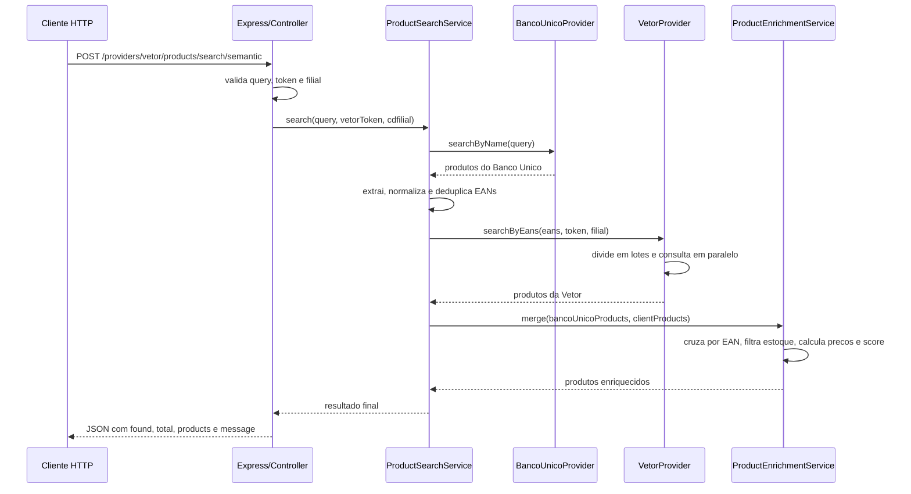

# Fluxo e Arquitetura do Projeto

## Visao geral

Este projeto expoe uma API HTTP em Node.js/Express para buscar produtos a partir de um texto livre, cruzar os resultados com o catalogo da Vetor usando EAN e devolver apenas os itens que tambem existem no provider do cliente.

Em termos simples, o fluxo e:

1. receber uma busca por nome
2. consultar o Banco Unico
3. extrair os EANs validos
4. consultar a Vetor por esses EANs
5. cruzar os dois conjuntos
6. retornar um payload final mais enxuto

## O que a API faz

O endpoint principal e:

```http
POST /providers/vetor/products/search/semantic
```

Ele espera um corpo JSON com:

- `query`: texto que sera enviado para o Banco Unico
- `vetorToken`: token da Vetor usado para autenticar a consulta do cliente
- `cdfilial` ou `cdFilial`: opcional, usado para filtrar os produtos da Vetor por filial

O retorno final nao e uma copia crua de nenhum provider. A aplicacao faz um enriquecimento:

- aproveita dados descritivos do Banco Unico
- aproveita estoque, classificacao e precos da Vetor
- cruza tudo pelo `EAN`
- ordena os resultados por regras de negocio

## Estrutura dos arquivos

```text
server.js
src/
  controllers/
    product.controller.js
  providers/
    banco_unico/
      banco_unico.provider.js
      banco_unico.mapper.js
    vetor/
      vetor.provider.js
      vetor.mapper.js
  routes/
    providers/
      vetor.routes.js
  services/
    product_search.service.js
    product_enrichment.service.js
    product_equivalence.service.js
    banco-unico-product.service.js
  utils/
    normalize-ean.js
  contracts/
    *.contract.js
```

## Responsabilidade de cada camada

### `server.js`

Inicializa o servidor Express:

- ativa parse de JSON
- ativa `cors`
- registra a rota `/providers/vetor`
- disponibiliza `GET /health`

### `src/routes/providers/vetor.routes.js`

Faz a montagem manual das dependencias:

- cria `BancoUnicoProvider`
- cria `VetorProvider`
- cria `ProductEnrichmentService`
- injeta tudo em `ProductSearchService`
- injeta o service em `ProductController`

Aqui esta o ponto de entrada da funcionalidade principal.

### `src/controllers/product.controller.js`

Cuida da camada HTTP:

- le o body da requisicao
- valida `query`
- valida `vetorToken`
- aceita tanto `cdfilial` quanto `cdFilial`
- garante que a filial, quando enviada, seja um inteiro
- chama o service principal
- devolve `200`, `404` ou `500`

### `src/services/product_search.service.js`

Orquestra o fluxo completo da busca:

1. consulta o Banco Unico por nome
2. extrai e normaliza os EANs retornados
3. consulta a Vetor por esses EANs
4. faz o merge dos resultados
5. monta a resposta final

### `src/services/product_enrichment.service.js`

Transforma dois conjuntos de dados em uma lista final de produtos:

- monta um indice de produtos da Vetor por EAN
- percorre os produtos do Banco Unico
- encontra o correspondente na Vetor
- descarta itens sem estoque minimo
- monta o payload final enriquecido
- ordena os resultados

### `src/providers/banco_unico/*`

Implementa a integracao com o Banco Unico:

- faz `POST /api/products/search/semantic`
- envia `query` e `limit: 50`
- transforma o retorno bruto em um modelo interno mais previsivel

### `src/providers/vetor/*`

Implementa a integracao com a Vetor:

- autentica com `Authorization: ApiKey <token>`
- quebra os EANs em lotes
- consulta os lotes em paralelo com limite configuravel
- monta filtro OData com `codigoBarras`
- transforma o retorno bruto em um modelo interno padronizado

### `src/utils/normalize-ean.js`

Normaliza EAN removendo tudo que nao for digito. Se nao sobrar nenhum digito, retorna `null`.

### `src/contracts/*.contract.js`

Funcionam como contratos abstratos para indicar a interface esperada dos providers. Hoje eles servem mais como documentacao de arquitetura do que como validacao real em runtime.

## Passo a passo completo de uma requisicao

### 1. A requisicao entra no Express

O cliente chama:

```http
POST /providers/vetor/products/search/semantic
Content-Type: application/json
```

Exemplo:

```json
{
  "query": "dipirona",
  "vetorToken": "SEU_TOKEN",
  "cdfilial": 3
}
```

### 2. O controller valida os parametros

Antes de fazer qualquer integracao externa, o controller confere:

- se `query` existe e nao esta vazia
- se `vetorToken` existe e nao esta vazio
- se `cdfilial` ou `cdFilial`, quando informados, representam um numero inteiro

Falhas nessa etapa retornam `400`.

### 3. O service consulta o Banco Unico

`ProductSearchService` chama `bancoUnicoProvider.searchByName(query)`.

O provider do Banco Unico:

- usa `axios`
- aponta para `BANCO_UNICO_API_BASE_URL`
- faz `POST /api/products/search/semantic`
- envia:

```json
{
  "query": "dipirona",
  "limit": 50
}
```

Depois disso, o mapper do Banco Unico converte os campos recebidos para um formato interno como:

- `id`
- `ean`
- `descricao`
- `nomeSocial`
- `principioAtivo`
- `fabricante`
- `similarity`
- `tokenOverlap`
- `exactEanMatch`

Se o Banco Unico nao retornar produtos, a API encerra com `404`.

### 4. Os EANs sao extraidos e normalizados

Com os produtos do Banco Unico em memoria, o service:

- pega o campo `ean` de cada item
- remove caracteres nao numericos
- elimina valores vazios
- remove duplicados com `Set`

Se nenhum EAN valido sobrar, a API encerra com `404`.

### 5. A Vetor e consultada por lotes

Com a lista de EANs pronta, `ProductSearchService` chama `clientProductProvider.searchByEans(...)`, que hoje e a implementacao da Vetor.

O `VetorProvider` faz varios passos:

1. valida novamente o token
2. remove EANs vazios e duplicados
3. divide a lista em lotes com tamanho definido por `VETOR_MAX_EANS_PER_REQUEST`
4. cria um client `axios` autenticado com `ApiKey`
5. monta um filtro OData com `codigoBarras`
6. adiciona `cdFilial eq <valor>` quando a filial e enviada
7. executa os lotes em paralelo com limite definido por `VETOR_MAX_PARALLEL_REQUESTS`

Um filtro gerado fica conceitualmente assim:

```text
(codigoBarras eq '7899547500363' or codigoBarras eq '7896004707726') and cdFilial eq 3
```

Cada lote consulta:

```http
GET /api/ecommerce/produtos/consulta?$filter=...&$top=500
```

Depois, `vetor.mapper.js` transforma a resposta em um formato interno comum, incluindo:

- `id`
- `codigo`
- `cdfilial`
- `ean`
- `descricao`
- `fabricante`
- `tipoClassificacao`
- `classificacaoOrigem`
- `estoque`
- `preco`
- `precoPromocional`
- `descontoPercentual`

Se a Vetor nao retornar nada, a API encerra com `404`.

### 6. O merge por EAN acontece no enrichment service

`ProductEnrichmentService.merge(...)` e onde a regra de negocio principal acontece.

Primeiro, ele cria um `Map` de produtos da Vetor indexado por EAN normalizado.

Depois, percorre os produtos do Banco Unico um a um:

1. normaliza o EAN do item
2. procura o correspondente no `Map` da Vetor
3. ignora o item se nao houver correspondencia
4. ignora o item se `estoque < 2`
5. monta o produto final

Essa etapa garante que a resposta final contenha apenas itens:

- presentes no Banco Unico
- presentes na Vetor
- com EAN valido
- com estoque minimo de `2`

### 7. O payload final e montado

Cada produto retornado combina campos dos dois lados.

Campos que vem principalmente do Banco Unico:

- `descricao`
- `principio_ativo`
- `match_externo`
- dados de similaridade e sobreposicao de tokens

Campos que vem principalmente da Vetor:

- `id`
- `codigo`
- `descricao_alpha7`
- `tipo_classificacao`
- `classificacao_nome_origem`
- `estoque_disponivel`
- `precos`

Algumas regras importantes:

- `descricao` final vem do Banco Unico
- `descricao_alpha7` vem da Vetor
- `estoque_disponivel` e formatado com 4 casas decimais
- o bloco `precos` so aparece quando existe algum dado de preco

### 8. O score de relevancia e calculado

O campo `relevancia_score` e calculado assim:

```text
(similarity * 10) + tokenOverlap + exactEanMatch
```

Onde:

- `similarity` vem do Banco Unico
- `tokenOverlap` vem do Banco Unico
- `exactEanMatch` vale `1` quando for `true`, senao `0`

O valor final e arredondado para 3 casas decimais.

### 9. Os produtos sao ordenados

Depois do merge, a lista final e ordenada por:

1. menor `preco_venda`
2. maior `similarity`
3. maior `relevancia_score`
4. `descricao` em ordem alfabetica

Na pratica, isso faz a API priorizar:

- produtos mais baratos
- entre eles, os mais aderentes a busca

### 10. A resposta HTTP e enviada

Se houver produtos validos apos o merge:

```json
{
  "found": true,
  "total": 1,
  "products": [],
  "message": "Produtos encontrados com sucesso"
}
```

Se algum ponto do fluxo nao encontrar dados, a API devolve `404` com uma mensagem especifica do motivo:

- nenhum produto no Banco Unico
- nenhum EAN valido
- nenhum produto no provider do cliente
- nenhum produto compativel apos o cruzamento

Se a entrada for invalida, devolve `400`.

Se acontecer excecao inesperada, devolve `500`.

## Diagrama de sequencia



## Regras de negocio observadas no codigo

- A busca textual acontece apenas no Banco Unico.
- A Vetor nao recebe a `query`; ela recebe somente os EANs resultantes da primeira busca.
- O cruzamento entre os dois mundos depende totalmente do EAN.
- Produtos com `estoque < 2` sao descartados.
- O retorno final mistura dados de origem externa com dados do cliente.
- O token da Vetor e enviado no body da requisicao, nao em header da API local.
- Quando existem EANs repetidos na resposta da Vetor, o ultimo item processado sobrescreve os anteriores no `Map` interno.

## Variaveis de ambiente

O projeto usa:

- `PORT`: porta local do servidor
- `BANCO_UNICO_API_BASE_URL`: base URL do Banco Unico
- `VETOR_API_BASE_URL`: base URL da Vetor
- `VETOR_MAX_EANS_PER_REQUEST`: tamanho de cada lote de EANs enviado para a Vetor
- `VETOR_MAX_PARALLEL_REQUESTS`: limite de lotes paralelos

Valores padrao observados no codigo:

- Banco Unico: `https://unicocontato.tech/banco-unico`
- Vetor: `https://integracao.zetti.dev`

## Pontos de extensao

O projeto foi organizado para crescer:

- a pasta `routes/providers` sugere suporte a mais providers no futuro
- os arquivos em `contracts/` indicam a interface esperada para novos provedores
- o service principal depende de abstracoes conceituais, nao de uma unica implementacao hardcoded

Hoje, porem, a rota ativa no servidor e apenas a da Vetor.

## Pecas que existem mas nao participam do fluxo atual

Alguns arquivos estao no repositorio, mas nao entram no caminho principal executado por `POST /providers/vetor/products/search/semantic`:

- `src/services/product_equivalence.service.js`
- `src/services/banco-unico-product.service.js`
- `src/contracts/fonte_pesquisa_produto.contract.js`

Eles parecem ser sobras de uma organizacao anterior ou pontos preparados para evolucao futura.

## Testes e observabilidade

Pelo estado atual do repositorio:

- nao existe suite automatizada de testes
- o script `npm test` ainda e apenas um placeholder
- erros de integracao sao registrados com `console.error`

Ou seja: o comportamento esta relativamente bem separado em camadas, mas a confiabilidade do fluxo ainda depende mais de validacao manual e testes de integracao externos do que de cobertura automatizada dentro do projeto.

## Resumo executivo

Se fosse resumir o projeto em uma frase:

> Esta API usa o Banco Unico como mecanismo de descoberta por texto e a Vetor como fonte de disponibilidade comercial, cruzando ambas por EAN para devolver apenas produtos validos para o cliente.
